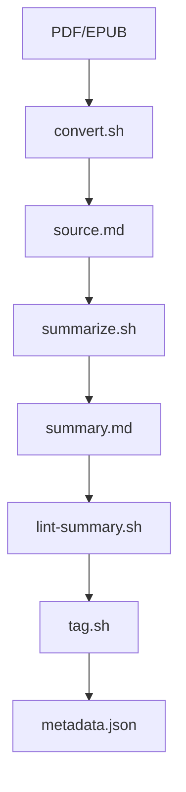
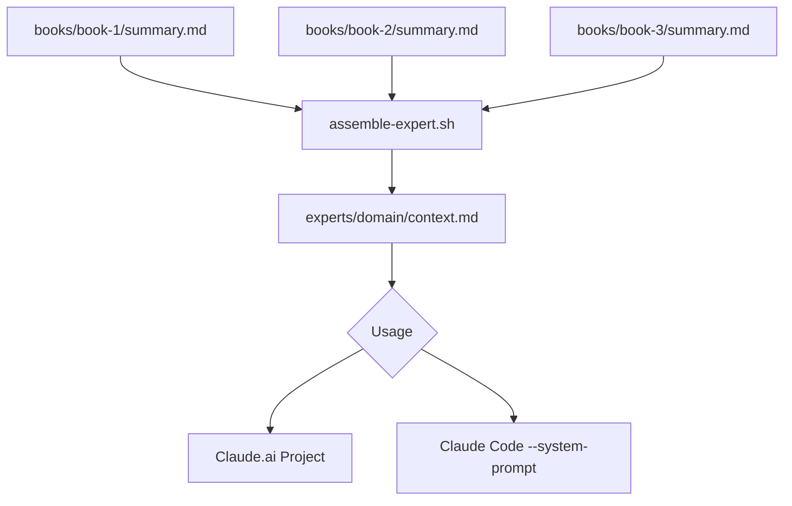
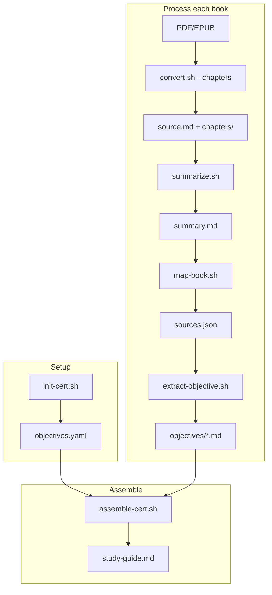

# Book Knowledge Base

A pipeline for extracting targeted knowledge from books and assembling
domain-specific expert agents or certification study guides.

<!-- toc -->

- [Project structure](#project-structure)
- [Workflows](#workflows)
  * [Process a new book](#process-a-new-book)
  * [Assemble an expert](#assemble-an-expert)
  * [Use an expert](#use-an-expert)
- [Certification study workflow](#certification-study-workflow)
  * [Initialize a certification](#initialize-a-certification)
  * [Process textbooks](#process-textbooks)
  * [Assemble study guide](#assemble-study-guide)
- [Key commands](#key-commands)
- [Notes](#notes)

<!-- tocstop -->

## Project structure

```
/books                  # Source materials and processed outputs
  /<book-slug>
    source.md           # Full converted text
    summary.md          # Distilled knowledge
    metadata.json       # Title, author, domain tags
    chapters/           # Optional: chapter-split source (for large books)
    objectives/         # Certification objective extracts

/certs                  # Certification definitions
  /<cert-slug>
    objectives.yaml     # Exam domains and objectives
    sources.json        # Which books map to which objectives
    study-guide.md      # Assembled study guide

/experts                # Assembled expert contexts
  /<domain-slug>
    context.md          # Combined summaries for this domain
    sources.json        # Which books contributed

/scripts                # Processing scripts
/templates              # Prompt templates
```

## Workflows

### Process a new book



```bash
# 1. Convert to markdown
./scripts/convert.sh path/to/book.pdf book-slug

# 2. Generate summary (interactive)
./scripts/summarize.sh book-slug

# 3. Lint the summary
./scripts/lint-summary.sh book-slug

# 4. Tag with domain(s)
./scripts/tag.sh book-slug "security,architecture"
```

### Assemble an expert



```bash
./scripts/assemble-expert.sh security
```

Output: `experts/security/context.md`

### Use an expert

- **Claude.ai**: Upload `experts/<domain>/context.md` to a Project
- **Claude Code**: `claude --system-prompt "$(cat experts/<domain>/context.md)"`

## Certification study workflow

For exam preparation with multiple textbooks organized by exam objectives.



### Initialize a certification

```bash
./scripts/init-cert.sh aws-saa
$EDITOR certs/aws-saa/objectives.yaml
```

### Process textbooks

```bash
# Convert with chapter splitting for large books
./scripts/convert.sh --chapters path/to/textbook.pdf aws-saa-guide

./scripts/summarize.sh aws-saa-guide
./scripts/map-book.sh aws-saa-guide aws-saa
./scripts/extract-objective.sh aws-saa-guide aws-saa 1.1
```

### Assemble study guide

```bash
./scripts/assemble-cert.sh aws-saa
```

Output: `certs/aws-saa/study-guide.md` organized by domain and objective.

## Key commands

| Task | Command |
| ---- | ------- |
| List all books | `ls books/` |
| List books by domain | `grep -l '"domain"' books/*/metadata.json` |
| View summary | `cat books/<slug>/summary.md` |
| List certifications | `ls certs/` |
| View study guide | `cat certs/<cert>/study-guide.md` |
| Lint all summaries | `./scripts/lint-summary.sh --all` |

## Notes

- Summaries are iterative: first pass extracts, you refine
- Domain tags are freeform; clustering happens organically
- Source text retained for future re-processing or RAG
